# show databases; 显示当前所有的数据库

# create database 名称（character set gbk）; 创建数据库

# drop database 名称; 删除数据库

# use 名称; 使用某个数据库

# 列名称是表中定义的变量名

# 创建表
```
create table students
	(
		id int unsigned not null auto_increment primary key,
		name char(8) not null,
		sex char(4) not null,
		age tinyint unsigned not null,
		tel char(13) null default "-"
	);
```

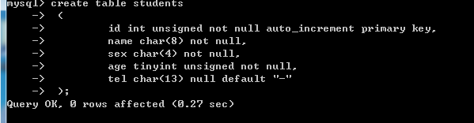

# show tables; 查看某个数据库有多少个表 


# desc students 查看表结构
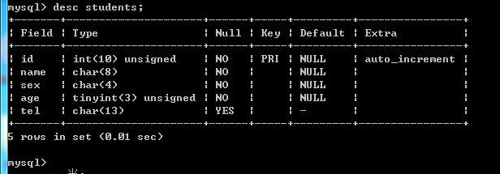

# 增 insert into
```
insert into students values(1，"wang", "m", 20, "13811371377");

insert into students(name,sex,age,tel) values("wang2", "w", 21, "13811371371");
```

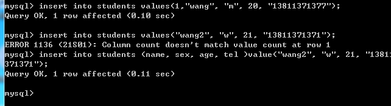

# 查 select from
```
select * from students;
```
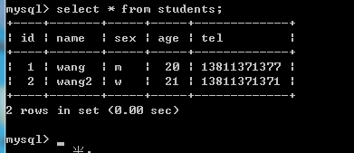

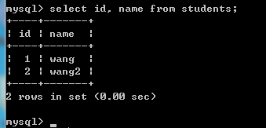

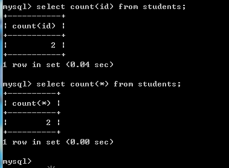

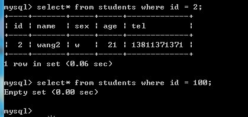

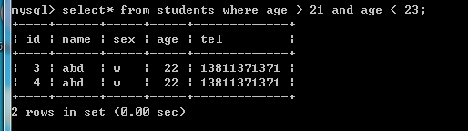

# 删 delete from 表名称 where 删除条件
```
delete from students where id = 2;
```

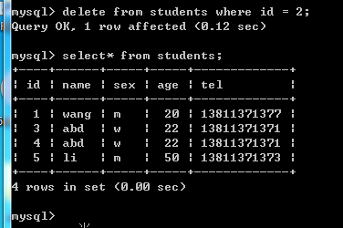

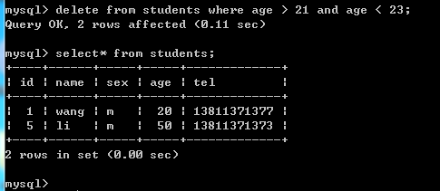

# 改 update 表名称 set 列名称=新值 where 更新条件;
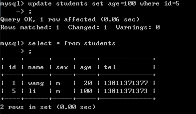

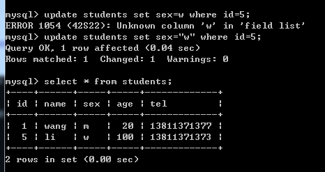

# 排序 order by 列名称 asc（desc）
默认升序

desc是descend 降序意思 

asc 是ascend 升序意思

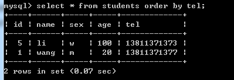

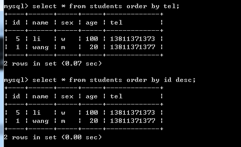
