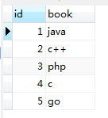
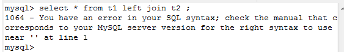

#mysql join的使用

## 创建如下的三张表

| t1      | t2          | t3  |
| ------------- |:-------------:| -----:|
|      |   |   |

```
DROP TABLE IF EXISTS `t1`;
CREATE TABLE `t1` (
  `id` int(11) NOT NULL,
  `book` varchar(255) CHARACTER SET utf8 DEFAULT NULL,
  PRIMARY KEY (`id`)
) ;

INSERT INTO `t1` VALUES ('1', 'java');
INSERT INTO `t1` VALUES ('2', 'c++');
INSERT INTO `t1` VALUES ('3', 'php');
INSERT INTO `t1` VALUES ('4', 'c');
INSERT INTO `t1` VALUES ('5', 'go');
```

## inner Join 内连接

将两个表中存在连接关系的字段，组成的记录集，叫做内连接（结合条件使用）。

 

```
select t1.id as id,book,author from t1, t2 where t1.id = t2.id;


select * from t1 inner join t2 using (id);
```


 ## cross join 交叉连接

 在Mysql中，Cross Join可以用逗号表达式表示，例如(table1, table 2)。在Mysql中，Cross Join 和 Inner Join 是等价的，但是在标准SQL中，它们并不等价，Inner Join 用于带有on表达式的连接，反之用Cross Join。以下两个SQL语句是等价的。

Cross Join 指的是两个table的笛卡尔积。


等价的sql语句 求笛卡尔集
```
select * from (t1,t2);

select * from t1 cross join t2;

select * from t1 nature join t2;

select * from t1 inner join t2; 
```


## left join 左外连接

左外连接A、B表的意思就是将表A中的全部记录和表B中字段连接形成的记录集，这里注意的是最后出来的记录集会包括表A的全部记录。如下：


---




---


实现如下的集合：


# right join 右外连接

右外连接和左外连接是类似的。为了方便数据库便于访问，推荐使用左外连接代替右外连接。

---

## 参考：

* http://blog.csdn.net/taylor_tao/article/details/7068511

* http://www.cnblogs.com/BeginMan/p/3754322.html