[数据库结构和数据](./mysql_select/mysql.sql)

# 1、 查询Student表中的所有记录的Sname、Ssex和Class列

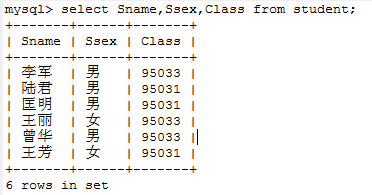

# 2、 查询教师所有的单位即不重复的Depart列
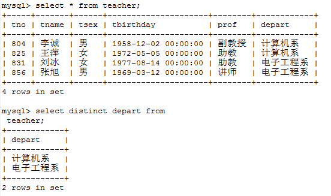

# 3、 查询Student表的所有记录。

# 4、 查询Score表中成绩在60到80之间的所有记录。
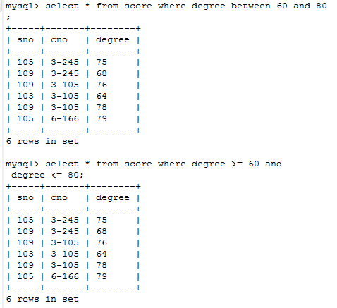

# 5、 查询Score表中成绩为85，86或88的记录。
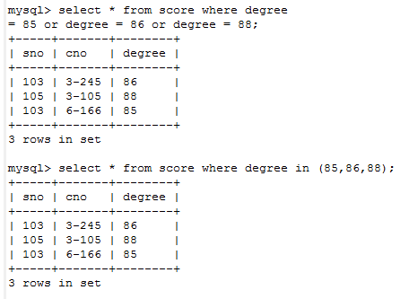

# 6、 查询Student表中“95031”班或性别为“女”的同学记录。
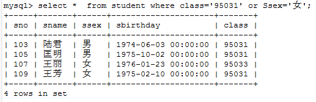

# 7、 以Class降序查询Student表的所有记录
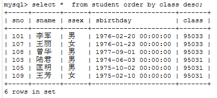

# 8、 以Cno升序、Degree降序查询Score表的所有记录。
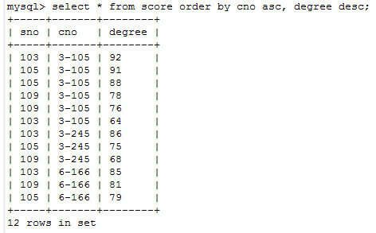

# 9、 查询“95031”班的学生人数。
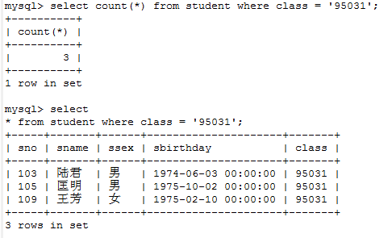

# 10、查询Score表中的最高分的学生学号和课程号。（子查询或者排序）
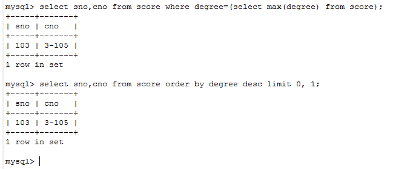

# 11、查询每门课的平均成绩。
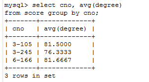

# 12、查询Score表中至少有5名学生选修的并以3开头的课程的平均分数。

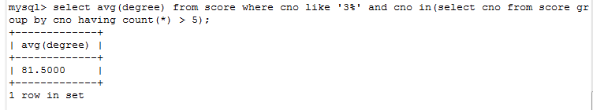

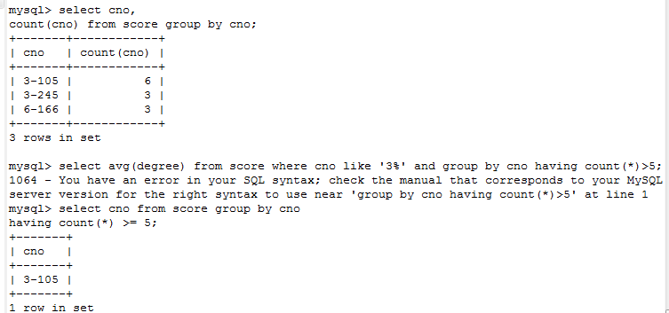

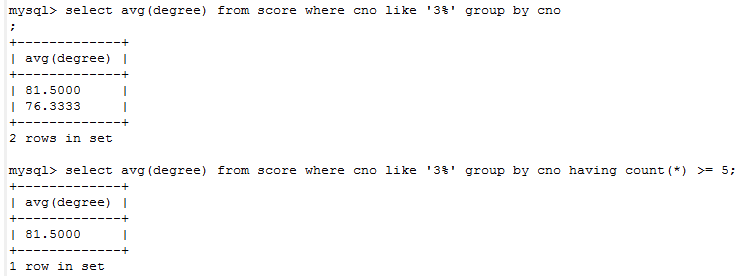

# 13、查询分数大于70，小于90的Sno列。
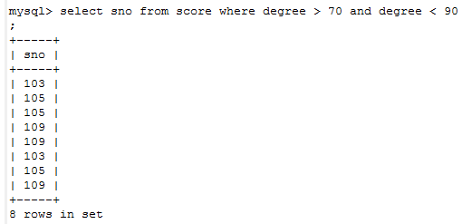

# 14、 查询所有学生的Sname、Cno和Degree列
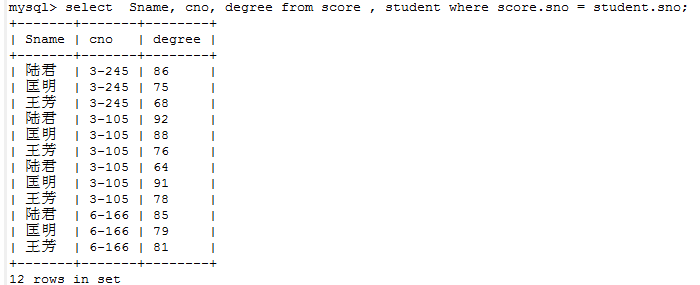

# 15、查询所有学生的Sno、Cname和Degree列。

# 16、查询所有学生的Sname、Cname和Degree列。
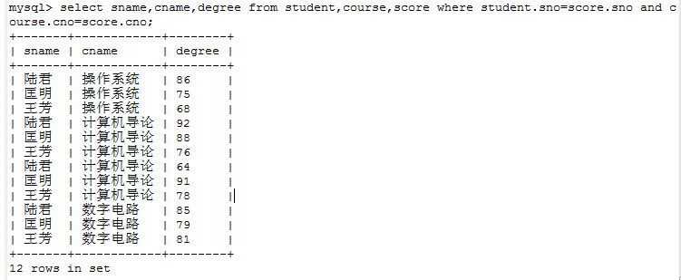

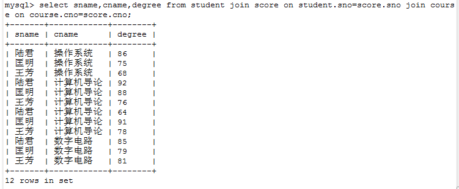

# 17、查询“95033”班学生的平均分。
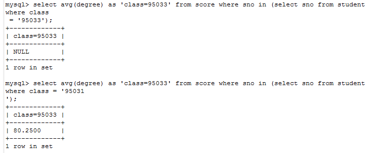

# 参考
http://www.cnblogs.com/aqxss/p/6563625.html